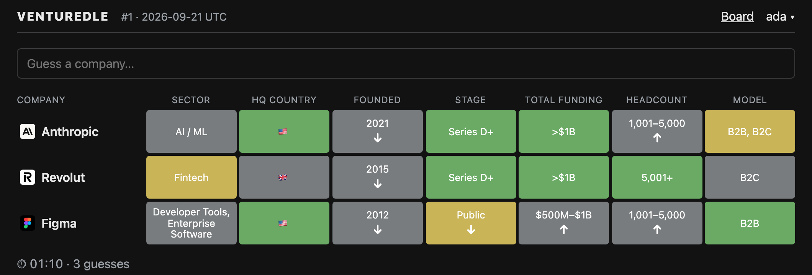

# Venturedle

A daily startup-guessing game in the Wordle / Loldle family. One secret company per UTC day; each
guess is scored across seven columns — sector, HQ country, founded year, funding stage, total
funding, headcount, business model — with green / yellow / grey feedback and higher/lower arrows.
Leaderboards rank players by guesses and by time.



It is meant to be **self-hosted for your own crowd**: your fund's portfolio, your accelerator's
batch, your corner of the market. With a [Harmonic](https://www.harmonic.ai) API key and one LLM
key (Anthropic, OpenAI or Gemini) you turn a list of domains into a schedule and run the whole
thing with `docker compose` on one small VM. Players sign in with a nickname, or with Google if
you want the leaderboard locked to your Workspace domain.

## Play it locally in 60 seconds

No API keys, no Docker — this uses the 30 well-known companies committed in
`data/companies.example.json`.

```bash
git clone https://github.com/Jesusdiazrivero/venturedle.git && cd venturedle
npm install            # Node 24 (see .nvmrc)
cp .env.example .env   # defaults: anonymous sign-in, the example schedule, DEV_TODAY=2026-01-01
npm run dev            # backend :8080 + frontend :5173
```

Open <http://localhost:5173>. `DEV_TODAY` pins "today" to the first day of the example schedule so
there is always a puzzle; bump it to `2026-01-02` to see the next one.

Other commands:

```bash
npm test               # vitest, all workspaces
npm run typecheck      # tsc --noEmit per workspace
npm run build          # typecheck + vite build → frontend/dist
```

## Make your own schedule

The extractor reads a domains file and writes `data/companies.json`, one company per consecutive
UTC day from `--start`. **Numbers (funding, headcount) come from Harmonic; only the categories
(sector, business model) come from the LLM**, and a domain with no funding or headcount figure is
rejected rather than guessed at.

```bash
# .env: HARMONIC_API_KEY plus exactly one of ANTHROPIC_API_KEY / OPENAI_API_KEY / GEMINI_API_KEY
printf 'stripe.com\nfigma.com\nrevolut.com\n' > data/domains.txt
npm run extract -- -d data/domains.txt -s 2026-10-01
npm run extract -- validate data/companies.json
```

Rejected domains land in `data/rejected.json` with a reason. `--provider` and `--model` override
the defaults (`DEFAULT_MODELS` in `extractor/src/llm.ts` — model ids go stale, check them).

**Cost.** One Harmonic enrichment credit and one small LLM call (~1–2k tokens) per domain, on
every run — there is no cache. A hundred domains is a few cents of tokens plus a hundred credits.
To extend a schedule, append to `domains.txt` and re-run with the _same_ `--start`; that re-fetches
everything, so batch your additions.

**`data/companies.json` is the answer key.** It is gitignored on purpose, so a public fork does not
publish its own solutions. Treat it as deploy-time data: copy it to the server, back it up with the
database. Only `companies.example.json` is committed.

No keys and just want a production-like run? `npm run example-schedule` re-dates the example file
to start today and writes it to `data/companies.json`.

## Run it with Docker

One image (the API and the built SPA in one process) plus Caddy for TLS. All state is the `data/`
directory: `companies.json` and `venturedle.db`.

```bash
npm run example-schedule                      # or your own extractor run
cd deploy && cp .env.example .env
DOMAIN=:80 docker compose up -d --build       # → http://localhost
```

`deploy/.env` is what the container sees: `DOMAIN`, `AUTH_MODE`, `GOOGLE_CLIENT_ID`,
`GOOGLE_ALLOWED_DOMAIN`, `PUBLIC_URL`. Set `DOMAIN` to a hostname and Caddy gets a Let's Encrypt
certificate automatically; `:80` is plain HTTP for a local or IP-only smoke test. The root `.env`
(with your Harmonic and LLM keys) is a separate file and never leaves your laptop.

Replacing `data/companies.json` on the host is picked up within 30 seconds, no restart.

## Deploy to GCP

A single `e2-micro` Compute Engine VM running Docker. In `us-west1`, `us-central1` or `us-east1`
it is in the Always Free tier; in Europe it is roughly €6–7/month. (Why a VM and not Cloud Run:
SQLite wants a real disk and a single writer — see `docs/07-decisions.md`.)

```bash
PROJECT=my-gcp-project ./deploy/gcp/create-vm.sh       # static IP, firewall, VM, daily snapshots
# point a DNS A record at the IP it prints, put DOMAIN=your.host in deploy/.env
./deploy/gcp/deploy.sh                                 # copy the context + schedule, build, start
```

`create-vm.sh` is safe to re-run. `deploy.sh` builds on the VM, which takes a few minutes the first
time on an e2-micro — `startup.sh` adds a 2 GB swapfile so it does not run out of memory. Both
scripts take `ZONE` and `NAME` (defaults `us-central1-a` and `venturedle`). Updating just the
schedule is the one `scp` line for `companies.json`; `docs/06-deployment.md` has it, along with the
build-locally-and-ship-the-image alternative and notes on Hetzner / Fly.io / any other Linux box.

### Google sign-in

Optional; the default is an anonymous nickname. Create an OAuth 2.0 Client ID (Web application) in
the same GCP project, with authorised JavaScript origins `https://your.host` and — for dev —
both `http://localhost` and `http://localhost:5173`. Then in `deploy/.env`:

```
AUTH_MODE=google
GOOGLE_CLIENT_ID=...apps.googleusercontent.com
GOOGLE_ALLOWED_DOMAIN=example.com    # optional: only this Workspace domain may sign in
```

No redirect URI is needed. Google does not accept bare IP addresses as origins, so a `DOMAIN=:80`
smoke test has to use anonymous mode.

### Backups

`create-vm.sh` attaches a daily disk snapshot schedule kept for 14 days. That captures
`companies.json` and the database together and is the whole backup story — restoring is "create a
disk from the snapshot". For a clean logical copy before a risky change:

```bash
sudo docker compose exec app node -e \
  "new (require('node:sqlite').DatabaseSync)('/data/venturedle.db').exec(\"VACUUM INTO '/data/backup.db'\")"
```

## Layout

| Folder       | What                                                                             |
| ------------ | -------------------------------------------------------------------------------- |
| `extractor/` | CLI: a domains file + a start date → `data/companies.json` via Harmonic + an LLM |
| `backend/`   | Hono API + SQLite (`node:sqlite`); also serves the built SPA                     |
| `frontend/`  | Vite + React SPA                                                                 |
| `shared/`    | types, enums, sector taxonomy, zod schemas, pure scoring                         |

The answer never reaches the browser before it is found: the seven-field `Company` type is
exported only from `@venturedle/shared/server`, which the SPA cannot import, and the scoring
happens on the server.

## Docs

The full design lives in [`docs/`](docs/) — start with
[`docs/00-overview.md`](docs/00-overview.md). Game rules and share text are in
[`01-game-rules.md`](docs/01-game-rules.md), the API and database in
[`04-backend.md`](docs/04-backend.md), deployment in
[`06-deployment.md`](docs/06-deployment.md), and why any of it is the way it is in
[`07-decisions.md`](docs/07-decisions.md).

## License

MIT — see [LICENSE](LICENSE).
